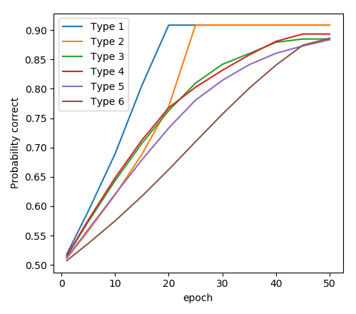

# ALCOVE model of category learning in PyTorch

Kruschke, J. K. (1992). ALCOVE: an exemplar-based connectionist model of category learning. Psychological Review, 99(1), 22.

You can run the main script as follows:
```python
python alcove.py
```

This script trains ALCOVE on the 6 category learning problems of  Shephard, Hovland, and Jenkins (1961) and plots their learning curves.

The main parameters are as follows:
- number of passes through exemplars (num_epochs)
- option to train ALCOVE or a multi-layer Perceptron
- use abstract binary data or real image data
- use hinge loss or log-likelihood loss
- learning rates for association weights and attention weights

There are a few modifications to Kruschke's original ALCOVE:

The original ALCOVE is modified as follows:
- With just two classes, we use only a single sigmoid output unit, instead of using a multi-class softmax output.
- Kruschke's original loss function has been replaced with either a maximum likelihood objective ("ll") or a hinge loss, which is a variant of the humble teacher used by Kruschke ("hinge")

